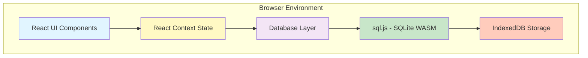

# Design Document: Grocery Tracker

## Overview

The Grocery Tracker is a local-first web application built with Next.js and TypeScript that enables household members to track grocery inventory, monitor stock levels, and manage restocking needs. The application operates entirely in the browser using SQLite compiled to WebAssembly (sql.js), with all data persisted locally using IndexedDB, ensuring complete privacy and offline functionality.

### Key Design Decisions

1. **Browser-Based SQLite**: Using sql.js (SQLite compiled to WebAssembly) to run the database entirely in the browser, eliminating the need for a Node.js server and enabling true local-first operation.

2. **IndexedDB Persistence**: Storing the SQLite database file in IndexedDB for reliable, persistent local storage that survives browser sessions.

3. **Static Site Generation**: Leveraging Next.js static export capabilities to create a fully client-side application that can run without a server.

4. **React Context for State**: Using React Context API for global state management to ensure UI updates propagate within the required 1-second timeframe.

5. **Color-Coded Organization**: Implementing a predefined color palette for categories and status indicators to create an intuitive, visually appealing interface.

## Architecture

### System Architecture



### Layer Responsibilities

1. **UI Layer**: React components for displaying and interacting with grocery data
2. **State Layer**: React Context managing application state and triggering re-renders
3. **Database Layer**: TypeScript service layer providing type-safe database operations
4. **SQLite Layer**: sql.js executing SQL queries in WebAssembly
5. **Storage Layer**: IndexedDB persisting the SQLite database file

### Data Flow

1. User interacts with UI component
2. Component calls database service method
3. Database service executes SQL via sql.js
4. sql.js updates in-memory database
5. Database service persists to IndexedDB
6. Database service updates React Context
7. Context triggers UI re-render (< 1 second)

## Components and Interfaces

### Core Components

#### 1. Database Service (`src/services/database.ts`)

Manages all database operations and provides type-safe interfaces.

```typescript
interface DatabaseService {
  initialize(): Promise<void>;
  
  // Household operations
  createHousehold(name: string, ownerId: string): Promise<Household>;
  getHousehold(id: string): Promise<Household | null>;
  getHouseholdByReferenceCode(code: string): Promise<Household | null>;
  getUserHouseholds(userId: string): Promise<HouseholdWithRole[]>;
  transferOwnership(householdId: string, newOwnerId: string): Promise<void>;
  deleteHousehold(householdId: string): Promise<void>;
  
  // User operations
  createUser(name: string): Promise<User>;
  getUser(id: string): Promise<User | null>;
  
  // Membership operations
  requestJoinHousehold(userId: string, referenceCode: string): Promise<HouseholdMembership>;
  getPendingMembershipRequests(householdId: string): Promise<HouseholdMembership[]>;
  acceptMembershipRequest(membershipId: string): Promise<void>;
  rejectMembershipRequest(membershipId: string): Promise<void>;
  addMemberDirectly(householdId: string, userId: string): Promise<HouseholdMembership>;
  getUserRole(userId: string, householdId: string): Promise<'owner' | 'member' | null>;
  getHouseholdMembers(householdId: string): Promise<User[]>;
  
  // Notification operations
  createNotification(userId: string, householdId: string | undefined, type: string, message: string): Promise<Notification>;
  getUserNotifications(userId: string): Promise<Notification[]>;
  markNotificationAsRead(notificationId: string): Promise<void>;
  getUnreadNotificationCount(userId: string): Promise<number>;
  
  // Category operations
  createCategory(name: string, color: string, householdId: string): Promise<Category>;
  getCategories(householdId: string): Promise<Category[]>;
  
  // Grocery item operations
  createGroceryItem(item: GroceryItemInput): Promise<GroceryItem>;
  updateGroceryItem(id: string, updates: Partial<GroceryItemInput>): Promise<void>;
  deleteGroceryItem(id: string): Promise<void>;
  getGroceryItems(householdId: string): Promise<GroceryItem[]>;
  
  // Stock operations
  addStock(itemId: string, quantity: number, userId: string): Promise<void>;
  useStock(itemId: string, quantity: number, userId: string): Promise<void>;
  getStockLevel(itemId: string): Promise<number>;
  getItemHistory(itemId: string): Promise<ItemHistory>;
  getStockTransactions(itemId: string): Promise<StockTransactionWithUser[]>;
  
  // Notification queries
  getLowStockItems(householdId: string): Promise<GroceryItem[]>;
  getExpiringItems(householdId: string, daysAhead: number): Promise<GroceryItem[]>;
  
  // Persistence
  saveToIndexedDB(): Promise<void>;
  loadFromIndexedDB(): Promise<void>;
}
```

#### 2. Application Context (`src/context/AppContext.tsx`)

Provides global state management for the application.

```typescript
interface AppContextValue {
  currentHousehold: Household | null;
  currentUser: User | null;
  userHouseholds: HouseholdWithRole[];
  currentUserRole: 'owner' | 'member' | null;
  categories: Category[];
  groceryItems: GroceryItem[];
  lowStockItems: GroceryItem[];
  expiringItems: GroceryItem[];
  pendingMembershipRequests: HouseholdMembership[];
  notifications: Notification[];
  unreadNotificationCount: number;
  
  // Actions
  switchHousehold(householdId: string): Promise<void>;
  refreshData(): Promise<void>;
  transferOwnership(newOwnerId: string): Promise<void>;
  deleteHousehold(): Promise<void>;
  requestJoinHousehold(referenceCode: string): Promise<void>;
  acceptMembershipRequest(membershipId: string): Promise<void>;
  rejectMembershipRequest(membershipId: string): Promise<void>;
  addMemberDirectly(userId: string): Promise<void>;
  markNotificationAsRead(notificationId: string): Promise<void>;
  addStock(itemId: string, quantity: number): Promise<void>;
  useStock(itemId: string, quantity: number): Promise<void>;
  viewItemHistory(itemId: string): Promise<ItemHistory>;
  createGroceryItem(item: GroceryItemInput): Promise<void>;
  updateGroceryItem(id: string, updates: Partial<GroceryItemInput>): Promise<void>;
  deleteGroceryItem(id: string): Promise<void>;
}
```

#### 3. UI Components

**Household Selector** (`src/components/HouseholdSelector.tsx`)
- Displays list of households the user can access
- Shows user's role (owner/member) for each household
- Allows switching between households
- Displays household reference code for owners
- Shows pending membership requests count for owners

**Join Household Form** (`src/components/JoinHouseholdForm.tsx`)
- Input field for entering reference code
- Submit button to request joining a household
- Displays success/error messages

**Membership Management Panel** (`src/components/MembershipPanel.tsx`)
- Lists pending membership requests (owner only)
- Shows user information for each request
- Provides accept/reject buttons
- Allows adding members directly by user ID
- Lists current household members
- Provides transfer ownership option (owner only)
- Provides delete household option (owner only)

**Notification Center** (`src/components/NotificationCenter.tsx`)
- Displays unread notification count badge
- Lists all notifications for the current user
- Shows notification type and message
- Allows marking notifications as read
- Highlights unread notifications

**Main Inventory View** (`src/components/InventoryView.tsx`)
- Displays all grocery items grouped by category
- Shows stock levels with visual indicators
- Highlights low stock and expiring items
- Provides quick actions for adding/using stock

**Category Section** (`src/components/CategorySection.tsx`)
- Displays items within a single category
- Uses category color for visual distinction
- Shows category name and item count

**Grocery Item Card** (`src/components/GroceryItemCard.tsx`)
- Displays individual item details
- Shows stock level, unit, and status indicators
- Provides buttons for stock operations
- Displays expiration date if present
- Provides button to view item history

**Item History Modal** (`src/components/ItemHistoryModal.tsx`)
- Displays when the item was created
- Lists all stock transactions in reverse chronological order
- Shows transaction type (added/used), quantity, user name, and timestamp
- Provides visual distinction between add and use transactions
- Shows formatted dates and times for each transaction

**Notifications Panel** (`src/components/NotificationsPanel.tsx`)
- Lists items needing restock
- Lists expired or expiring items
- Allows filtering by notification type

**Item Management Form** (`src/components/ItemForm.tsx`)
- Form for creating/editing grocery items
- Category selection
- Metadata input fields

### Database Schema

```sql
-- Households table
CREATE TABLE households (
  id TEXT PRIMARY KEY,
  name TEXT NOT NULL,
  reference_code TEXT NOT NULL UNIQUE,
  owner_id TEXT NOT NULL,
  created_at INTEGER NOT NULL,
  FOREIGN KEY (owner_id) REFERENCES users(id)
);

-- Users table
CREATE TABLE users (
  id TEXT PRIMARY KEY,
  name TEXT NOT NULL,
  created_at INTEGER NOT NULL
);

-- Household memberships table (many-to-many relationship)
CREATE TABLE household_memberships (
  id TEXT PRIMARY KEY,
  user_id TEXT NOT NULL,
  household_id TEXT NOT NULL,
  role TEXT NOT NULL CHECK(role IN ('owner', 'member')),
  status TEXT NOT NULL CHECK(status IN ('active', 'pending')) DEFAULT 'active',
  created_at INTEGER NOT NULL,
  FOREIGN KEY (user_id) REFERENCES users(id),
  FOREIGN KEY (household_id) REFERENCES households(id),
  UNIQUE(user_id, household_id)
);

-- Notifications table
CREATE TABLE notifications (
  id TEXT PRIMARY KEY,
  user_id TEXT NOT NULL,
  household_id TEXT,
  type TEXT NOT NULL CHECK(type IN ('ownership_transfer', 'household_deletion', 'membership_approved')),
  message TEXT NOT NULL,
  is_read INTEGER NOT NULL DEFAULT 0,
  created_at INTEGER NOT NULL,
  FOREIGN KEY (user_id) REFERENCES users(id),
  FOREIGN KEY (household_id) REFERENCES households(id)
);

-- Categories table
CREATE TABLE categories (
  id TEXT PRIMARY KEY,
  name TEXT NOT NULL,
  color TEXT NOT NULL,
  household_id TEXT NOT NULL,
  created_at INTEGER NOT NULL,
  FOREIGN KEY (household_id) REFERENCES households(id),
  UNIQUE(name, household_id)
);

-- Grocery items table
CREATE TABLE grocery_items (
  id TEXT PRIMARY KEY,
  name TEXT NOT NULL,
  category_id TEXT NOT NULL,
  household_id TEXT NOT NULL,
  restock_threshold REAL NOT NULL DEFAULT 1.0,
  unit TEXT NOT NULL DEFAULT 'pieces',
  notes TEXT,
  expiration_date INTEGER,
  stock_level REAL NOT NULL DEFAULT 0.0,
  created_at INTEGER NOT NULL,
  updated_at INTEGER NOT NULL,
  FOREIGN KEY (category_id) REFERENCES categories(id),
  FOREIGN KEY (household_id) REFERENCES households(id)
);

-- Stock transactions table (for audit trail)
CREATE TABLE stock_transactions (
  id TEXT PRIMARY KEY,
  grocery_item_id TEXT NOT NULL,
  user_id TEXT NOT NULL,
  transaction_type TEXT NOT NULL CHECK(transaction_type IN ('add', 'use')),
  quantity REAL NOT NULL,
  timestamp INTEGER NOT NULL,
  FOREIGN KEY (grocery_item_id) REFERENCES grocery_items(id),
  FOREIGN KEY (user_id) REFERENCES users(id)
);

-- Indexes for performance
CREATE INDEX idx_household_memberships_user ON household_memberships(user_id);
CREATE INDEX idx_household_memberships_household ON household_memberships(household_id);
CREATE INDEX idx_household_memberships_status ON household_memberships(status);
CREATE INDEX idx_notifications_user ON notifications(user_id);
CREATE INDEX idx_notifications_read ON notifications(is_read);
CREATE INDEX idx_grocery_items_household ON grocery_items(household_id);
CREATE INDEX idx_grocery_items_category ON grocery_items(category_id);
CREATE INDEX idx_stock_transactions_item ON stock_transactions(grocery_item_id);
CREATE INDEX idx_stock_transactions_user ON stock_transactions(user_id);
CREATE INDEX idx_stock_transactions_timestamp ON stock_transactions(timestamp);
```

## Data Models

### TypeScript Interfaces

```typescript
interface Household {
  id: string;
  name: string;
  referenceCode: string;
  ownerId: string;
  createdAt: number;
}

interface User {
  id: string;
  name: string;
  createdAt: number;
}

interface HouseholdMembership {
  id: string;
  userId: string;
  householdId: string;
  role: 'owner' | 'member';
  status: 'active' | 'pending';
  createdAt: number;
}

interface Category {
  id: string;
  name: string;
  color: string;
  householdId: string;
  createdAt: number;
}

interface GroceryItem {
  id: string;
  name: string;
  categoryId: string;
  householdId: string;
  restockThreshold: number;
  unit: string;
  notes?: string;
  expirationDate?: number; // Unix timestamp
  stockLevel: number;
  createdAt: number;
  updatedAt: number;
}

interface GroceryItemInput {
  name: string;
  categoryId: string;
  householdId: string;
  restockThreshold?: number;
  unit?: string;
  notes?: string;
  expirationDate?: number;
  initialStockLevel?: number;
}

interface StockTransaction {
  id: string;
  groceryItemId: string;
  userId: string;
  transactionType: 'add' | 'use';
  quantity: number;
  timestamp: number;
}

interface StockTransactionWithUser {
  transaction: StockTransaction;
  user: User;
}

interface ItemHistory {
  itemCreatedAt: number;
  transactions: StockTransactionWithUser[];
}

interface NotificationStatus {
  isLowStock: boolean;
  isExpired: boolean;
  isExpiringSoon: boolean;
  daysUntilExpiration?: number;
}

interface HouseholdWithRole {
  household: Household;
  role: 'owner' | 'member';
}

interface Notification {
  id: string;
  userId: string;
  householdId?: string;
  type: 'ownership_transfer' | 'household_deletion' | 'membership_approved';
  message: string;
  isRead: boolean;
  createdAt: number;
}
```

### Color Palette

Predefined colors for categories and status indicators:

```typescript
const CATEGORY_COLORS = [
  '#FF6B6B', // Red
  '#4ECDC4', // Teal
  '#45B7D1', // Blue
  '#FFA07A', // Light Salmon
  '#98D8C8', // Mint
  '#F7DC6F', // Yellow
  '#BB8FCE', // Purple
  '#85C1E2', // Sky Blue
  '#F8B88B', // Peach
  '#A8E6CF', // Light Green
];

const STATUS_COLORS = {
  lowStock: '#FF9800', // Orange
  expired: '#F44336', // Red
  expiringSoon: '#FFC107', // Amber
  normal: '#4CAF50', // Green
};
```

### Sample Data

Initial sample data to populate on first use:

```typescript
const SAMPLE_CATEGORIES = [
  { name: 'Dairy', color: '#4ECDC4' },
  { name: 'Produce', color: '#A8E6CF' },
  { name: 'Meat', color: '#FF6B6B' },
  { name: 'Pantry', color: '#F7DC6F' },
  { name: 'Beverages', color: '#45B7D1' },
];

const SAMPLE_ITEMS = [
  { name: 'Milk', category: 'Dairy', stock: 2, threshold: 1, unit: 'liters' },
  { name: 'Eggs', category: 'Dairy', stock: 6, threshold: 12, unit: 'pieces' },
  { name: 'Apples', category: 'Produce', stock: 8, threshold: 5, unit: 'pieces' },
  { name: 'Chicken Breast', category: 'Meat', stock: 0.5, threshold: 1, unit: 'kg' },
  { name: 'Rice', category: 'Pantry', stock: 3, threshold: 2, unit: 'kg' },
  { name: 'Orange Juice', category: 'Beverages', stock: 1, threshold: 2, unit: 'liters' },
];
```


## Error Handling

### Error Categories

1. **Database Errors**
   - Database initialization failure
   - SQL execution errors
   - IndexedDB access denied
   - Data corruption

2. **Validation Errors**
   - Invalid input data (empty names, negative quantities)
   - Duplicate category names
   - Missing required fields
   - Invalid date formats

3. **State Errors**
   - Negative stock levels
   - Missing household/user context
   - Orphaned references (deleted categories)

4. **Browser Compatibility Errors**
   - IndexedDB not supported
   - WebAssembly not supported
   - Insufficient storage quota

### Error Handling Strategy

#### Database Layer

```typescript
class DatabaseError extends Error {
  constructor(message: string, public code: string, public cause?: Error) {
    super(message);
    this.name = 'DatabaseError';
  }
}

// Example usage
try {
  await db.execute(sql);
} catch (error) {
  throw new DatabaseError(
    'Failed to create grocery item',
    'DB_CREATE_FAILED',
    error
  );
}
```

#### Validation Layer

```typescript
interface ValidationResult {
  isValid: boolean;
  errors: string[];
}

function validateGroceryItem(item: GroceryItemInput): ValidationResult {
  const errors: string[] = [];
  
  if (!item.name || item.name.trim().length === 0) {
    errors.push('Item name is required');
  }
  
  if (!item.categoryId) {
    errors.push('Category is required');
  }
  
  if (item.restockThreshold !== undefined && item.restockThreshold < 0) {
    errors.push('Restock threshold cannot be negative');
  }
  
  if (item.initialStockLevel !== undefined && item.initialStockLevel < 0) {
    errors.push('Initial stock level cannot be negative');
  }
  
  return {
    isValid: errors.length === 0,
    errors,
  };
}
```

#### UI Error Display

- Display validation errors inline near form fields
- Show database errors in a toast notification
- Provide user-friendly error messages
- Log technical details to console for debugging
- Offer recovery actions where possible (e.g., "Retry" button)

#### Graceful Degradation

- If IndexedDB is unavailable, warn user that data won't persist
- If WebAssembly is unsupported, display compatibility message
- If database is corrupted, offer to reset with sample data
- If stock would go negative, set to zero and warn user

### Error Recovery

1. **Database Initialization Failure**
   - Attempt to load from IndexedDB
   - If corrupted, create fresh database
   - Populate with sample data
   - Notify user of data loss

2. **Persistence Failure**
   - Retry save operation up to 3 times
   - If all retries fail, warn user
   - Continue operating with in-memory data
   - Attempt to save on next operation

3. **Invalid State**
   - Validate data on load
   - Remove orphaned references
   - Fix negative stock levels
   - Log corrections for user review

## Testing Strategy

### Testing Approach

The Grocery Tracker will employ a dual testing strategy combining unit tests for specific scenarios and property-based tests for comprehensive validation of universal behaviors.

### Unit Testing

Unit tests will focus on:

1. **Specific Examples**: Concrete test cases demonstrating correct behavior
   - Creating a household with a specific name
   - Adding 5 units of stock to an item
   - Deleting a grocery item

2. **Edge Cases**: Boundary conditions and special scenarios
   - Empty database initialization
   - Using stock when level is already zero
   - Expiration date exactly 3 days away
   - Category with no items

3. **Error Conditions**: Invalid inputs and error handling
   - Creating item with empty name
   - Adding negative stock quantity
   - Deleting non-existent item
   - Database connection failure

4. **Integration Points**: Component interactions
   - Database service with sql.js
   - React Context with database service
   - UI components with Context

### Property-Based Testing

Property-based tests will verify universal properties across all inputs using a property-based testing library. Each test will run a minimum of 100 iterations with randomly generated inputs.

**Library Selection**: We will use `fast-check` for TypeScript/JavaScript property-based testing.

**Configuration**:
```typescript
import fc from 'fast-check';

// Example property test configuration
fc.assert(
  fc.property(
    fc.string(), // arbitrary string generator
    fc.nat(), // arbitrary natural number generator
    (name, quantity) => {
      // Property assertion
    }
  ),
  { numRuns: 100 } // Minimum 100 iterations
);
```

**Test Tagging**: Each property test will include a comment referencing the design document property:

```typescript
// Feature: grocery-tracker, Property 1: Stock addition increases level
test('adding stock increases stock level', () => {
  fc.assert(/* ... */);
});
```

### Test Coverage Goals

- Unit test coverage: > 80% of code paths
- Property test coverage: All correctness properties from design
- Integration test coverage: All major user workflows
- Error handling coverage: All error categories

### Testing Tools

- **Test Runner**: Jest or Vitest
- **Property Testing**: fast-check
- **React Testing**: React Testing Library
- **Database Testing**: In-memory sql.js instance
- **Coverage**: Istanbul/nyc


## Correctness Properties

*A property is a characteristic or behavior that should hold true across all valid executions of a system-essentially, a formal statement about what the system should do. Properties serve as the bridge between human-readable specifications and machine-verifiable correctness guarantees.*

### Property 1: Entity Creation Uniqueness

*For any* set of created entities (households, users, categories, or grocery items), all generated identifiers should be unique within their entity type.

**Validates: Requirements 1.1, 2.1**

### Property 2: Data Persistence Round-Trip

*For any* entity (household, user, category, or grocery item) that is created, retrieving it from the database by its ID should return an equivalent entity with the same attributes.

**Validates: Requirements 1.2, 2.2, 3.2, 4.2**

### Property 3: User-Household Association

*For any* user and any existing household, after the user is added as a member (either through approval or direct addition), querying the user's household memberships should include that household.

**Validates: Requirements 1.4, 1.5, 2.1.6**

### Property 3.1: Household Reference Code Uniqueness

*For any* set of created households, all generated reference codes should be unique across all households.

**Validates: Requirements 1.2**

### Property 3.2: Owner Assignment

*For any* created household, the creating user should be assigned as the owner with an active membership.

**Validates: Requirements 1.1**

### Property 3.3: Multiple Household Access

*For any* user who is a member or owner of multiple households, querying their accessible households should return all households where they have an active membership.

**Validates: Requirements 1.4, 1.5, 2.3**

### Property 3.4: Pending Membership Request

*For any* user who requests to join a household using a valid reference code, a pending membership record should be created with status 'pending'.

**Validates: Requirements 2.1.2, 2.1.3**

### Property 3.5: Membership Approval

*For any* pending membership request, after the owner accepts it, the membership status should change to 'active' and the user should have access to the household.

**Validates: Requirements 2.1.5, 2.1.6**

### Property 3.6: Role Tracking

*For any* user-household association, the system should correctly track whether the user is an 'owner' or 'member' for that specific household.

**Validates: Requirements 2.4**

### Property 3.7: Ownership Transfer

*For any* household with an owner and an active member, after transferring ownership to that member, the previous owner should have role 'member' and the new owner should have role 'owner', and both should have active memberships.

**Validates: Requirements 1.1.1, 1.1.2, 1.1.3, 1.1.5**

### Property 3.8: Ownership Transfer Notification

*For any* ownership transfer, all active members of the household should receive a notification about the ownership change.

**Validates: Requirements 1.1.4**

### Property 3.9: Household Deletion Cascade

*For any* household that is deleted, all associated data (categories, grocery items, stock transactions, and memberships) should be removed from the database.

**Validates: Requirements 1.2.3, 1.2.4**

### Property 3.10: Household Deletion Notification

*For any* household deletion, all active members should receive a notification before the household is deleted.

**Validates: Requirements 1.2.2**

### Property 4: User Household Invariant

*For any* user who has created or joined at least one household, querying their household associations should return at least one household with an active membership.

**Validates: Requirements 2.3**

### Property 5: Category Name Uniqueness

*For any* household, all categories within that household should have unique names (case-insensitive).

**Validates: Requirements 3.1**

### Property 6: Category Assignment

*For any* grocery item and any valid category, after assigning the category to the item, retrieving the item should show it belongs to that category.

**Validates: Requirements 3.3**

### Property 7: Items Grouped by Category

*For any* set of grocery items retrieved for a household, when grouped by category, all items with the same category ID should appear in the same group, and no item should appear in multiple groups.

**Validates: Requirements 3.4, 5.4**

### Property 8: Category Color Assignment

*For any* created category, it should have a non-empty color value assigned.

**Validates: Requirements 3.5**

### Property 9: Grocery Item Required Fields

*For any* created grocery item, it should have all required fields populated: name (non-empty), category ID (valid reference), restock threshold (non-negative), and unit (non-empty).

**Validates: Requirements 4.1**

### Property 10: Stock Level Initialization

*For any* grocery item created without an explicit initial stock level, its stock level should be zero. For any item created with an explicit initial stock level, its stock level should match the specified value.

**Validates: Requirements 4.3**

### Property 11: Item Household Association

*For any* created grocery item, it should have a valid household ID that references an existing household.

**Validates: Requirements 4.4**

### Property 12: Item Metadata Update

*For any* grocery item and any valid metadata update (name, notes, restock threshold, unit, expiration date), after applying the update, retrieving the item should reflect the new values while preserving unchanged fields.

**Validates: Requirements 4.5**

### Property 13: Item Deletion

*For any* grocery item, after deletion, querying for that item by ID should return null or not found.

**Validates: Requirements 4.6**

### Property 14: Stock Level Retrieval

*For any* grocery item, querying its stock level should return a non-negative number that matches the item's current stock state.

**Validates: Requirements 5.1, 5.2**

### Property 15: Stock Addition

*For any* grocery item with current stock level S and any positive quantity Q, after adding Q units of stock, the item's stock level should equal S + Q.

**Validates: Requirements 6.1, 6.2, 6.4**

### Property 16: Stock Usage

*For any* grocery item with current stock level S and any positive quantity Q where Q ≤ S, after using Q units of stock, the item's stock level should equal S - Q.

**Validates: Requirements 7.1, 7.2**

### Property 17: Stock Transaction Recording

*For any* stock operation (add or use), there should be a corresponding transaction record in the database with the correct item ID, user ID, transaction type, quantity, and a valid timestamp.

**Validates: Requirements 6.3, 7.3**

### Property 17.1: Item History Completeness

*For any* grocery item, querying its history should return all stock transactions associated with that item, sorted by timestamp in descending order.

**Validates: Requirements 6.1.1, 6.1.7**

### Property 17.2: Transaction User Attribution

*For any* stock transaction in an item's history, the transaction should include the user who performed the operation.

**Validates: Requirements 6.1.2**

### Property 17.3: Transaction Timestamp Accuracy

*For any* stock transaction, the recorded timestamp should be within a reasonable time window (e.g., 1 second) of when the operation was performed.

**Validates: Requirements 6.1.3**

### Property 17.4: Transaction Details Preservation

*For any* stock transaction, the history should preserve the transaction type (add or use) and the quantity involved.

**Validates: Requirements 6.1.4, 6.1.5**

### Property 17.5: Item Creation Timestamp

*For any* grocery item, its history should include the timestamp when the item was initially created.

**Validates: Requirements 6.1.6**

### Property 18: Low Stock Identification

*For any* grocery item where stock level ≤ restock threshold, it should appear in the low stock items list. For any item where stock level > restock threshold, it should not appear in the low stock items list.

**Validates: Requirements 8.1, 8.3**

### Property 19: Expiration Identification

*For any* grocery item with an expiration date that is in the past or within 3 days from now, it should appear in the expiring items list. For any item with an expiration date more than 3 days in the future or no expiration date, it should not appear in the expiring items list.

**Validates: Requirements 8.2, 8.4**

### Property 20: Notification Filtering

*For any* household, querying for low stock items should return only items meeting the low stock criteria, querying for expiring items should return only items meeting the expiration criteria, and an item can appear in both lists if it meets both criteria.

**Validates: Requirements 8.5**

### Property 21: Low Stock Status Indicator

*For any* grocery item where stock level ≤ restock threshold, the item's status should include a low stock indicator flag.

**Validates: Requirements 8.6**

### Property 22: Expiration Status Indicator

*For any* grocery item that is expired or expiring within 3 days, the item's status should include an expiration indicator flag.

**Validates: Requirements 8.7**

### Property 23: Multiple Status Indicators

*For any* grocery item that has both stock level ≤ restock threshold AND is expired/expiring within 3 days, the item's status should include both the low stock indicator and the expiration indicator.

**Validates: Requirements 8.8**

### Property 24: Database Reinitialization

*For any* set of data (households, users, categories, items) that is persisted to the database, after reinitializing the database service and loading from storage, all the original data should be retrievable with equivalent values.

**Validates: Requirements 9.3, 9.4**

### Property 25: Distinct Category Colors

*For any* two different categories within the same household, they should have different color values assigned to provide visual distinction.

**Validates: Requirements 11.4**

### Edge Cases

The following edge cases will be handled by property test generators and explicit unit tests:

- **Empty stock usage** (7.4): When using more stock than available, the stock level should be set to zero rather than becoming negative
- **Empty database initialization** (9.5): The system should successfully initialize when no database exists
- **Sample data population** (10.1-10.4): When the database is empty on first use, it should be populated with sample data including multiple categories and varied stock levels

