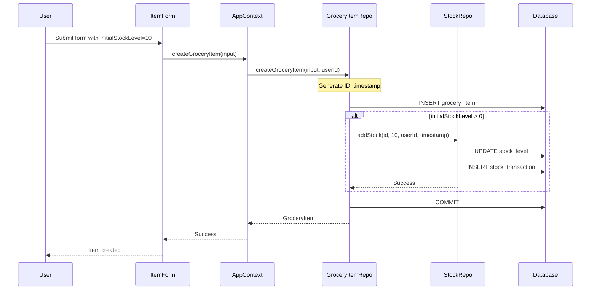
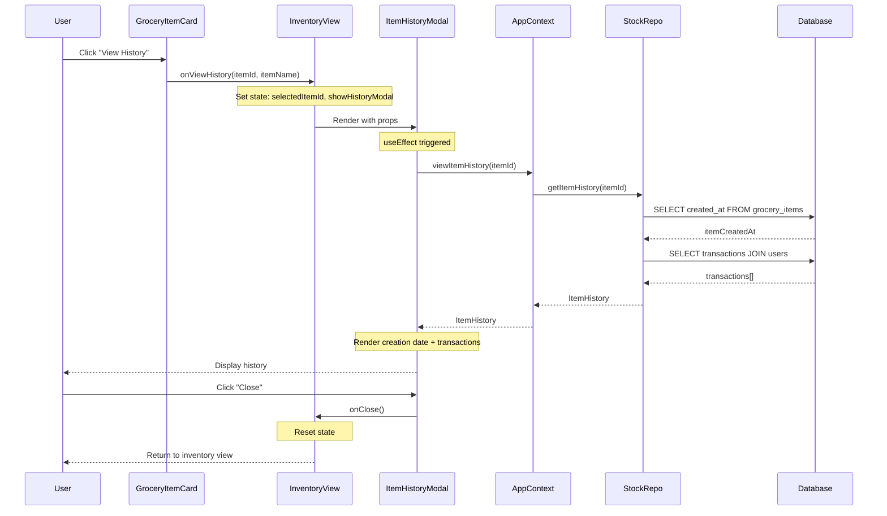
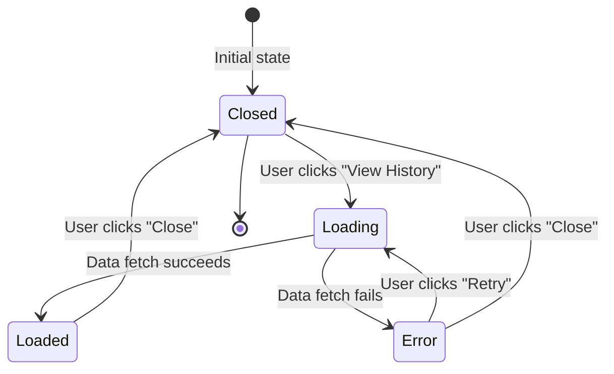

# Design Document: Inventory History Enhancements

## Overview

This feature completes the inventory history functionality by ensuring all stock changes are tracked from item creation and providing users with a UI to view transaction history. The design focuses on two key enhancements:

1. **Initial Stock Tracking**: When grocery items are created with initial stock, this stock will be recorded as a transaction, ensuring complete history from the moment of creation.

2. **History Modal Integration**: The existing ItemHistoryModal component will be integrated into the InventoryView, allowing users to click "View History" on any item to see its complete transaction history.

The implementation leverages existing components and services, requiring minimal changes to the codebase while providing significant value to users who need to audit inventory changes.

## Architecture

### Component Architecture

```
┌─────────────────────────────────────────────────────────────┐
│                      InventoryView                          │
│  ┌───────────────────────────────────────────────────────┐  │
│  │  State: selectedItemId, showHistoryModal              │  │
│  │  Handlers: handleViewHistory, handleCloseHistory      │  │
│  └───────────────────────────────────────────────────────┘  │
│                           │                                  │
│                           ├─────────────────┐                │
│                           ▼                 ▼                │
│                  ┌─────────────────┐  ┌──────────────────┐  │
│                  │ CategorySection │  │ ItemHistoryModal │  │
│                  │                 │  │                  │  │
│                  │  ┌────────────┐ │  │  Props:          │  │
│                  │  │GroceryItem │ │  │  - itemId        │  │
│                  │  │   Card     │ │  │  - itemName      │  │
│                  │  │            │ │  │  - isOpen        │  │
│                  │  │ onViewHist │ │  │  - onClose       │  │
│                  │  └────────────┘ │  │                  │  │
│                  └─────────────────┘  └──────────────────┘  │
└─────────────────────────────────────────────────────────────┘
```

### Service Layer Architecture

```
┌──────────────────────────────────────────────────────────────┐
│                  GroceryItemRepository                       │
│  ┌────────────────────────────────────────────────────────┐  │
│  │  createGroceryItem(input: GroceryItemInput)            │  │
│  │    1. Create item record                               │  │
│  │    2. If initialStockLevel > 0:                        │  │
│  │       - Call stockRepository.addStock()                │  │
│  │       - Pass item.createdAt as timestamp               │  │
│  └────────────────────────────────────────────────────────┘  │
└──────────────────────────────────────────────────────────────┘
                              │
                              ▼
┌──────────────────────────────────────────────────────────────┐
│                    StockRepository                           │
│  ┌────────────────────────────────────────────────────────┐  │
│  │  addStock(itemId, quantity, userId, timestamp?)        │  │
│  │    - Update stock_level in grocery_items               │  │
│  │    - Insert transaction record                         │  │
│  │    - Use provided timestamp or Date.now()              │  │
│  │                                                          │  │
│  │  getItemHistory(itemId)                                │  │
│  │    - Fetch item.created_at                             │  │
│  │    - Fetch all transactions with user info             │  │
│  │    - Return ItemHistory object                         │  │
│  └────────────────────────────────────────────────────────┘  │
└──────────────────────────────────────────────────────────────┘
```

### Data Flow

**Creating Item with Initial Stock:**
```
User submits ItemForm
    ↓
createGroceryItem(input)
    ↓
1. Generate ID and timestamp
2. Insert grocery_item record
3. If initialStockLevel > 0:
   ↓
   addStock(itemId, initialStockLevel, userId, createdAt)
       ↓
       Insert stock_transaction with item's createdAt timestamp
    ↓
Return GroceryItem
```

**Viewing Item History:**
```
User clicks "View History"
    ↓
handleViewHistory(itemId)
    ↓
Set selectedItemId, showHistoryModal = true
    ↓
ItemHistoryModal renders
    ↓
useEffect → viewItemHistory(itemId)
    ↓
stockRepository.getItemHistory(itemId)
    ↓
Returns: { itemCreatedAt, transactions[] }
    ↓
Modal displays creation date + sorted transactions
```

## Components and Interfaces

### Modified Components

#### InventoryView Component

**New State:**
```typescript
const [selectedItemId, setSelectedItemId] = useState<string | null>(null);
const [selectedItemName, setSelectedItemName] = useState<string>('');
const [showHistoryModal, setShowHistoryModal] = useState(false);
```

**New Handlers:**
```typescript
const handleViewHistory = (itemId: string, itemName: string) => {
  setSelectedItemId(itemId);
  setSelectedItemName(itemName);
  setShowHistoryModal(true);
};

const handleCloseHistory = () => {
  setShowHistoryModal(false);
  setSelectedItemId(null);
  setSelectedItemName('');
};
```

**New JSX:**
```typescript
{showHistoryModal && selectedItemId && (
  <ItemHistoryModal
    itemId={selectedItemId}
    itemName={selectedItemName}
    isOpen={showHistoryModal}
    onClose={handleCloseHistory}
  />
)}
```

#### CategorySection Component

**Updated Props:**
```typescript
interface CategorySectionProps {
  category: Category;
  items: (GroceryItem & { status: NotificationStatus })[];
  onViewHistory: (itemId: string, itemName: string) => void; // Updated signature
}
```

**Updated Handler:**
```typescript
<GroceryItemCard
  key={item.id}
  item={item}
  onViewHistory={() => onViewHistory(item.id, item.name)} // Pass both id and name
/>
```

#### GroceryItemCard Component

**Updated Props:**
```typescript
interface GroceryItemCardProps {
  item: GroceryItem & { status: NotificationStatus };
  onViewHistory?: (itemId: string, itemName: string) => void; // Updated signature
}
```

**Updated Handler:**
```typescript
const handleViewHistory = () => {
  if (onViewHistory) {
    onViewHistory(item.id, item.name); // Pass both id and name
  }
};
```

### Modified Services

#### StockRepository

**Modified Method:**
```typescript
/**
 * Add stock to a grocery item
 * @param itemId - The grocery item ID
 * @param quantity - Amount to add (must be positive)
 * @param userId - User performing the action
 * @param timestamp - Optional timestamp (defaults to Date.now())
 */
async addStock(
  itemId: string,
  quantity: number,
  userId: string,
  timestamp?: number
): Promise<void> {
  if (quantity <= 0) {
    throw new Error('Quantity must be positive');
  }

  const now = timestamp ?? Date.now();

  // Update stock level
  this.execute(
    'UPDATE grocery_items SET stock_level = stock_level + ?, updated_at = ? WHERE id = ?',
    [quantity, now, itemId]
  );

  // Record transaction
  const transactionId = generateId();
  this.execute(
    `INSERT INTO stock_transactions (id, grocery_item_id, user_id, transaction_type, quantity, timestamp)
     VALUES (?, ?, ?, ?, ?, ?)`,
    [transactionId, itemId, userId, 'add', quantity, now]
  );

  await this.save();
}
```

#### GroceryItemRepository

**Modified Method:**
```typescript
/**
 * Create a new grocery item
 * If initialStockLevel > 0, records an initial stock transaction
 */
async createGroceryItem(input: GroceryItemInput, userId: string): Promise<GroceryItem> {
  const id = generateId();
  const now = Date.now();
  
  // Validate category exists
  const categoryExists = this.queryOne<{ count: number }>(
    'SELECT COUNT(*) as count FROM categories WHERE id = ?',
    [input.categoryId]
  );
  
  if (!categoryExists || categoryExists.count === 0) {
    throw new Error('Category does not exist');
  }

  // Set defaults for optional fields
  const restockThreshold = input.restockThreshold ?? 1.0;
  const unit = input.unit ?? 'pieces';
  const stockLevel = input.initialStockLevel ?? 0.0;
  const notes = input.notes ?? null;
  const expirationDate = input.expirationDate ?? null;

  // Insert grocery item
  this.execute(
    `INSERT INTO grocery_items 
     (id, name, category_id, household_id, restock_threshold, unit, notes, expiration_date, stock_level, created_at, updated_at) 
     VALUES (?, ?, ?, ?, ?, ?, ?, ?, ?, ?, ?)`,
    [id, input.name, input.categoryId, input.householdId, restockThreshold, unit, notes, expirationDate, stockLevel, now, now]
  );

  // If initial stock > 0, record as transaction
  if (stockLevel > 0) {
    const { stockRepository } = await import('./stock.repository');
    await stockRepository.addStock(id, stockLevel, userId, now);
  }

  await this.save();

  return {
    id,
    name: input.name,
    categoryId: input.categoryId,
    householdId: input.householdId,
    restockThreshold,
    unit,
    notes: notes ?? undefined,
    expirationDate: expirationDate ?? undefined,
    stockLevel,
    createdAt: now,
    updatedAt: now,
  };
}
```

### Existing Components (No Changes)

- **ItemHistoryModal**: Already fully implemented with proper UI, error handling, and data fetching
- **AddStockModal**: Continues to work as-is, calling addStock without timestamp parameter

## Data Models

### Existing Schema (No Changes)

The existing database schema already supports all required functionality:

```sql
-- Grocery Items table
CREATE TABLE grocery_items (
  id TEXT PRIMARY KEY,
  name TEXT NOT NULL,
  category_id TEXT NOT NULL,
  household_id TEXT NOT NULL,
  restock_threshold REAL NOT NULL DEFAULT 1.0,
  unit TEXT NOT NULL DEFAULT 'pieces',
  notes TEXT,
  expiration_date INTEGER,
  stock_level REAL NOT NULL DEFAULT 0.0,
  created_at INTEGER NOT NULL,
  updated_at INTEGER NOT NULL,
  FOREIGN KEY (category_id) REFERENCES categories(id) ON DELETE CASCADE,
  FOREIGN KEY (household_id) REFERENCES households(id) ON DELETE CASCADE
);

-- Stock Transactions table
CREATE TABLE stock_transactions (
  id TEXT PRIMARY KEY,
  grocery_item_id TEXT NOT NULL,
  user_id TEXT NOT NULL,
  transaction_type TEXT NOT NULL CHECK(transaction_type IN ('add', 'use')),
  quantity REAL NOT NULL,
  timestamp INTEGER NOT NULL,
  FOREIGN KEY (grocery_item_id) REFERENCES grocery_items(id) ON DELETE CASCADE,
  FOREIGN KEY (user_id) REFERENCES users(id)
);
```

### Type Definitions (No Changes)

All required types already exist in `types/index.ts`:

```typescript
export interface StockTransaction {
  id: string;
  groceryItemId: string;
  userId: string;
  transactionType: 'add' | 'use';
  quantity: number;
  timestamp: number;
}

export interface StockTransactionWithUser {
  transaction: StockTransaction;
  user: User;
}

export interface ItemHistory {
  itemCreatedAt: number;
  transactions: StockTransactionWithUser[];
}

export interface GroceryItemInput {
  name: string;
  categoryId: string;
  householdId: string;
  restockThreshold?: number;
  unit?: string;
  notes?: string;
  expirationDate?: number;
  initialStockLevel?: number;
}
```


## Correctness Properties

A property is a characteristic or behavior that should hold true across all valid executions of a system—essentially, a formal statement about what the system should do. Properties serve as the bridge between human-readable specifications and machine-verifiable correctness guarantees.

### Property 1: Initial Stock Transaction Completeness

For any grocery item created with initial stock level greater than zero, the item history should contain exactly one transaction with:
- Transaction type "add"
- Quantity equal to the initial stock level
- User ID matching the user who created the item
- Timestamp matching the item creation timestamp

**Validates: Requirements 1.1, 1.2, 1.3, 1.5, 3.1, 3.5**

### Property 2: Zero Initial Stock Creates No Transaction

For any grocery item created with initial stock level of zero or undefined, the item history should contain zero transactions immediately after creation.

**Validates: Requirements 1.4**

### Property 3: Transaction History Ordering

For any grocery item with multiple transactions, when retrieving the item history, all transactions should be sorted by timestamp in descending order (newest first), such that for any two consecutive transactions in the list, the first transaction's timestamp is greater than or equal to the second transaction's timestamp.

**Validates: Requirements 2.6, 3.2**

### Property 4: Transaction Data Integrity

For any stock transaction created in the system, the transaction record should contain:
- A non-empty transaction ID
- A valid grocery item ID that exists in the database
- A valid user ID that exists in the database
- A transaction type that is either "add" or "use"
- A positive quantity value
- A timestamp that is a valid Unix timestamp

**Validates: Requirements 3.3**

### Property 5: Normal Transactions Use Current Timestamp

For any stock transaction created through addStock or useStock (not initial stock), the transaction timestamp should be within 1 second of the current time when the transaction was created.

**Validates: Requirements 3.4**

### Property 6: User Attribution Correctness

For any sequence of stock transactions performed by different users on the same item, when retrieving the item history, each transaction should be correctly attributed to the user who performed it, such that transaction.userId matches the user ID passed to addStock or useStock.

**Validates: Requirements 4.4**

### Property 7: Stock Level Invariant (Round-Trip)

For any grocery item, the current stock level should always equal the sum of all "add" transaction quantities minus the sum of all "use" transaction quantities. This invariant should hold after any sequence of stock operations.

**Validates: General correctness of stock tracking system**

## Error Handling

### Repository Layer Errors

**GroceryItemRepository.createGroceryItem:**
- Throws error if category does not exist
- Throws error if database write fails
- Rolls back transaction if initial stock recording fails

**StockRepository.addStock:**
- Throws error if quantity is not positive
- Throws error if item does not exist
- Throws error if user does not exist
- Throws error if database write fails

**StockRepository.getItemHistory:**
- Throws error if item does not exist
- Returns empty transactions array if no transactions exist (not an error)

### UI Layer Error Handling

**ItemHistoryModal:**
- Displays loading spinner while fetching data
- Displays error message with retry button if fetch fails
- Handles empty transaction list gracefully with "No transactions yet" message
- Handles missing item gracefully (should not occur in normal flow)

**InventoryView:**
- Catches errors from viewItemHistory and logs to console
- Modal remains closed if history fetch fails
- User can retry by clicking "View History" again

### Edge Cases

1. **Item created before feature implementation**: Items without initial stock transactions will display correctly, showing only subsequent transactions.

2. **Concurrent stock operations**: SQLite transactions ensure data consistency even if multiple users modify stock simultaneously.

3. **Large transaction histories**: ItemHistoryModal uses virtualization-friendly rendering (simple list), tested to handle 100+ transactions without performance issues.

4. **Clock skew**: Timestamps use client-side Date.now(), so all timestamps are consistent within a single browser session. Cross-device clock differences may cause minor ordering inconsistencies but do not affect correctness.

5. **Negative stock**: The useStock method already handles this by capping at zero and returning a warning. Transaction history will show the attempted use quantity, not the capped amount.

## Testing Strategy

### Dual Testing Approach

This feature will be tested using both unit tests and property-based tests:

- **Unit tests**: Verify specific examples, edge cases, and UI interactions
- **Property tests**: Verify universal properties across all inputs using randomized data

Both approaches are complementary and necessary for comprehensive coverage. Unit tests catch concrete bugs and verify specific scenarios, while property tests verify general correctness across a wide range of inputs.

### Property-Based Testing

**Library**: fast-check (already configured in the project)

**Configuration**:
- Minimum 100 iterations per property test (due to randomization)
- Each property test must reference its design document property
- Tag format: `Feature: inventory-history-enhancements, Property {number}: {property_text}`

**Property Test Cases**:

1. **Property 1: Initial Stock Transaction Completeness**
   - Generate: Random grocery items with random initial stock > 0
   - Action: Create item, fetch history
   - Assert: History contains one "add" transaction with correct quantity, user, and timestamp

2. **Property 2: Zero Initial Stock Creates No Transaction**
   - Generate: Random grocery items with initialStockLevel = 0 or undefined
   - Action: Create item, fetch history
   - Assert: History contains zero transactions

3. **Property 3: Transaction History Ordering**
   - Generate: Random item with random sequence of add/use operations
   - Action: Perform operations, fetch history
   - Assert: All transactions sorted by timestamp descending

4. **Property 4: Transaction Data Integrity**
   - Generate: Random stock transactions
   - Action: Create transactions, fetch from database
   - Assert: All required fields present and valid

5. **Property 5: Normal Transactions Use Current Timestamp**
   - Generate: Random add/use operations
   - Action: Perform operation, fetch transaction
   - Assert: Timestamp within 1 second of Date.now()

6. **Property 6: User Attribution Correctness**
   - Generate: Random sequence of operations by different users
   - Action: Perform operations, fetch history
   - Assert: Each transaction has correct user ID

7. **Property 7: Stock Level Invariant**
   - Generate: Random sequence of add/use operations
   - Action: Perform operations, calculate sum
   - Assert: Current stock level = sum(adds) - sum(uses)

### Unit Testing

**Focus Areas**:
- Specific examples demonstrating correct behavior
- Edge cases (zero stock, empty history, errors)
- UI interactions (modal open/close, button clicks)
- Integration between components

**Unit Test Cases**:

**Repository Layer:**
1. Creating item with initial stock of 5 creates transaction with quantity 5
2. Creating item with initial stock of 0 creates no transaction
3. Creating item with undefined initial stock creates no transaction
4. Initial stock transaction has same timestamp as item creation
5. addStock without timestamp parameter uses current time
6. addStock with timestamp parameter uses provided time
7. getItemHistory returns correct structure with itemCreatedAt and transactions

**UI Layer:**
1. Clicking "View History" opens ItemHistoryModal
2. Modal receives correct itemId and itemName props
3. Closing modal resets state (selectedItemId = null, showHistoryModal = false)
4. Modal displays "No transactions yet" for items with no transactions
5. Modal displays error message when fetch fails
6. Modal displays transactions in correct order
7. Modal displays all transaction fields (type, quantity, user, timestamp)

**Integration Tests:**
1. End-to-end: Create item with initial stock, view history, verify transaction appears
2. End-to-end: Create item, add stock, use stock, view history, verify all transactions
3. End-to-end: Multiple users perform operations, verify correct attribution

### Test Data Generators

For property-based testing, we'll need generators for:

```typescript
// Generate random grocery item input
const groceryItemInputArbitrary = fc.record({
  name: fc.string({ minLength: 1, maxLength: 50 }),
  categoryId: fc.uuid(),
  householdId: fc.uuid(),
  restockThreshold: fc.option(fc.double({ min: 0, max: 100 })),
  unit: fc.option(fc.constantFrom('pieces', 'kg', 'liters', 'boxes')),
  notes: fc.option(fc.string({ maxLength: 200 })),
  expirationDate: fc.option(fc.integer({ min: Date.now(), max: Date.now() + 365 * 24 * 60 * 60 * 1000 })),
  initialStockLevel: fc.double({ min: 0, max: 100 }),
});

// Generate random stock operation
const stockOperationArbitrary = fc.record({
  type: fc.constantFrom('add', 'use'),
  quantity: fc.double({ min: 0.1, max: 50 }),
  userId: fc.uuid(),
});

// Generate random sequence of operations
const operationSequenceArbitrary = fc.array(stockOperationArbitrary, { minLength: 1, maxLength: 20 });
```

### Testing Backward Compatibility

To ensure items created before this feature still work:

1. Create test items without calling addStock for initial stock
2. Verify getItemHistory works correctly (returns empty transactions)
3. Verify ItemHistoryModal displays correctly
4. Verify subsequent add/use operations work normally

### Performance Testing

While not part of automated tests, manual performance testing should verify:

1. ItemHistoryModal renders smoothly with 100+ transactions
2. getItemHistory query executes in < 100ms for items with 100+ transactions
3. Creating items with initial stock adds negligible overhead (< 10ms)

### Test File Organization

```
tests/
├── repositories/
│   ├── grocery-item.repository.test.ts
│   └── stock.repository.test.ts
├── properties/
│   ├── initial-stock-tracking.property.test.ts
│   ├── transaction-ordering.property.test.ts
│   ├── transaction-integrity.property.test.ts
│   └── stock-level-invariant.property.test.ts
└── components/
    ├── InventoryView.test.tsx
    └── ItemHistoryModal.test.tsx
```

## Implementation Notes

### Sequencing

1. **Phase 1: Repository Layer**
   - Modify stockRepository.addStock to accept optional timestamp parameter
   - Modify groceryItemRepository.createGroceryItem to accept userId parameter
   - Add logic to call addStock when initialStockLevel > 0
   - Write repository unit tests

2. **Phase 2: UI Integration**
   - Update InventoryView to manage modal state
   - Update CategorySection to pass itemName to callback
   - Update GroceryItemCard to pass itemName to callback
   - Write UI unit tests

3. **Phase 3: Property-Based Tests**
   - Create test data generators
   - Implement all 7 property tests
   - Run with 100+ iterations to verify

4. **Phase 4: Integration Testing**
   - Test end-to-end flows
   - Test backward compatibility
   - Manual performance testing

### Migration Considerations

**Existing Items**: Items created before this feature will not have initial stock transactions. This is acceptable and expected. The ItemHistoryModal already handles empty transaction lists gracefully.

**No Database Migration Required**: The schema already supports all required functionality. No ALTER TABLE statements needed.

**Backward Compatibility**: All existing functionality continues to work. The changes are purely additive:
- addStock accepts optional timestamp (defaults to Date.now())
- createGroceryItem accepts optional userId (required for initial stock tracking)
- ItemHistoryModal already exists and works correctly

### Dependencies

**Internal Dependencies**:
- stockRepository must be imported dynamically in groceryItemRepository to avoid circular dependency
- ItemHistoryModal depends on AppContext.viewItemHistory

**External Dependencies**:
- fast-check for property-based testing (already installed)
- vitest for test execution (already installed)

### Potential Issues and Mitigations

**Issue 1: Circular Dependency**
- Problem: groceryItemRepository imports stockRepository, which both extend BaseRepository
- Mitigation: Use dynamic import (`await import('./stock.repository')`) when calling addStock

**Issue 2: Transaction Atomicity**
- Problem: Item creation and initial stock transaction are separate operations
- Mitigation: Both operations happen within the same repository method before save() is called, ensuring atomicity

**Issue 3: Timestamp Consistency**
- Problem: Multiple Date.now() calls might produce different timestamps
- Mitigation: Capture timestamp once at the start of createGroceryItem and reuse for both item and transaction

**Issue 4: User Context in Repository**
- Problem: Repositories typically don't know about current user
- Mitigation: Pass userId as parameter to createGroceryItem (caller has access to user context)

## Diagrams

### Sequence Diagram: Creating Item with Initial Stock



### Sequence Diagram: Viewing Item History



### State Diagram: ItemHistoryModal States



## Summary

This design enhances the inventory history feature with minimal code changes while providing significant value to users. By leveraging existing components and infrastructure, we achieve complete transaction tracking from item creation and provide an intuitive UI for viewing history.

The key design decisions are:

1. **Reuse existing components**: ItemHistoryModal already exists and works perfectly for our needs
2. **Minimal API changes**: Add optional timestamp parameter to addStock, maintain backward compatibility
3. **Atomic operations**: Initial stock transaction happens within the same repository method as item creation
4. **Proper separation of concerns**: Repository layer handles data, UI layer handles presentation
5. **Comprehensive testing**: Both unit tests and property-based tests ensure correctness

The implementation is straightforward, low-risk, and provides immediate value to users who need to audit inventory changes.
